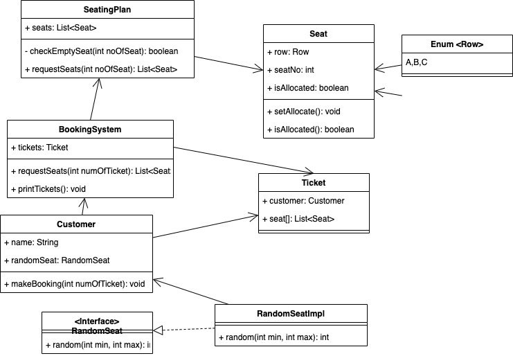

# cinnamon-cinemas
## UML diagram
## Class Diagram:


## To run the unit test:
1. Run the unit test
```
mvn clean test
```

## Flow:
1. Run the BookingSystem main to start the program.
```
mvn compile exec:java -Dexec.mainClass="BookingSystem"
```
2. It will auto create the customer and generate the random request of 1-3 seats.
3. After each booking, it will print the seats allocated
4. If there is not enough seats left, system will ends.

## Assumptions
1. System will not take any input
2. System will output the seats allocated for each customers until the seats left unable to fulfill the request of customer


## Approaches
1. Seat: Implement logic for assigning "allocated" to false at the beginning of the program
2. Seat: Implement logic to provide function to set seat allocated
3. SeatingPlan: Create a seating plan with 15 seat and marked the seat no.
4. SeatingPlan: Provide function to check if there is still enough empty seat to allocate
5. BookingSystem: Provide function for booking system to mark seat(s) allocated
6. BookingSystem: init the seating plan
7. BookingSystem: show the welcome message
8. Customer: generate the random seat request
9. Implement main function: To ask Customer for random seat request and allocate the seat. 
 if seating plan still have space, print the seat allocated, and then loop again, else end the program

## Future thoughts
1. Add seating plan for different movies distinguished by date time
2. Add more seats